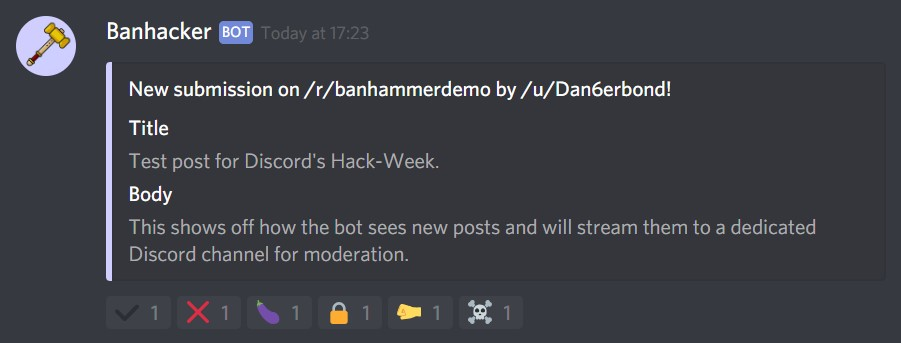
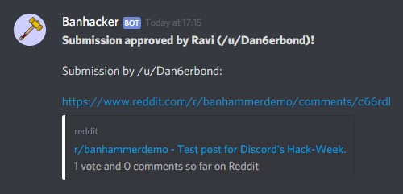
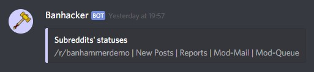
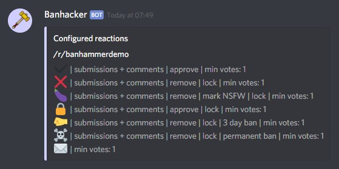
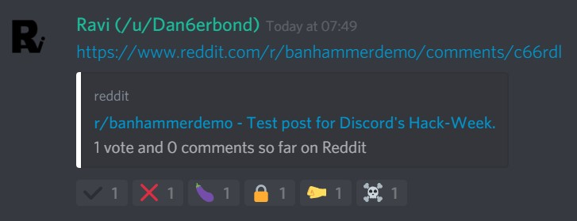
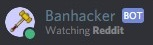

# Banhacker
By [Mariavi](https://dan6erbond.github.io/mariavi)

Banhacker is the very first bot to integrate the [Banhammer Framework](https://github.com/Dan6erbond/Banhammer-Framework), thus enabling a seamless moderation experience for Reddit. It was created for the **2019 Discord Hack Week Event** and showcases the functionality of the framework in a very simple fashion on [Mariavi's Banhammer Discord server](https://discordapp.com/invite/9JrGC8f). Additionally, it serves as a testing platform for the framework and will continue to do so in the future.

## Functionality
The bot streams different types of items from subreddits that are registered to it, such as reported posts, mod actions, and mod-mail to dedicated channels and allows you to react to some of them with **Reactions**. Its current configuration scans everything in a five-minute loop.

**Example of new post streamed to its dedicated channel:**

After you respond to a message by clicking on one of its reactions, Banhacker will perform the action configured to the selected reaction, delete the source message from the current channel, and send the message to either the `#🔨approved-posts` or `#🔨removed-posts` channel. Those actions can be customized by going to the subreddit's wiki page (called `banhammer-reactions`), which is automatically created if it doesn't exist and automatically filled with default reactions if there aren't any configured.

**Example of post approved by a moderator:**

### Commands
Banhacker doesn't make much use of Discord.py's command framework due to its design, though it has two commands and one `on_message()` trigger. All the commands use the `!` prefix.

 - `help`: The default Discord.py help command. A version of the Mariavi HelpCommand will be integrated in the future.
 - `status`: Displays all the subreddits set up and their activated streams.
 - `reactions`: Shows an embed with all the subreddits and their reactions, with relevant attributes.
 
Subreddits' statuses           | Reactions
:-----------------------------:|:-------------------------:
  | 
 
Banhacker allows users to post URLs in a channel within the `BANHACKER` category (e.g. `#🔨mod-chat`) and then take action on it. When a message is sent to one of the channels, Banhacker will search for Reddit URLs in the message pointing to an item within the registered subreddit(s) and add any applicable reactions to the message. If more than one URL is found, the first one is used.

### Presence
To showcase a recently added feature to the framework, the bot's presence changes to "Playing on /r/subname" when Banhammer is scanning subreddits. This helps moderators know when the bot is busy and may not be able to respond to reactions and commands.

**The bot's changed presence when scanning a subreddit:**

## Personal Use
Banhacker's code can be downloaded and slightly modified, particularly the channel IDs within each trigger function, as well as the subreddit and its settings if you wish to create your own version of this bot. The framework is still a work in progress, but documentation and updates can be found on the [GitHub page](https://github.com/Dan6erbond/Banhammer-Framework).

If you want to use this bot's code as a base, make sure you install both [PRAW](https://praw.readthedocs.io) and [Discord.py](https://discordpy.readthedocs.io) as they are required by the bot. They can be installed with the following commands:
 - `pip3 install -U discord.py`
 - `pip3 install -U praw`

## Note for Discord Hack Week judges
Due to the fact that the demo gives you moderation access to the /r/banhammerdemo subreddit, if you have joined to evaluate the bot's functionality, you will need to notify the moderators of the server so they can assign a role to you. You will then see the `##🔨mod-chat`, `#🔨new-posts`, `#🔨approved-posts`, `#🔨removed-posts`, `#🔨mod-mail`, `#🔨report-queue`, `#🔨mod-queue` and `#🔨mod-actions` channels within the `BANHACKER` category.

Though the repository has undergone changes since the end of submissions, the demo in the Mariavi server uses the state of the commit [e94abad](https://github.com/Dan6erbond/Banhacker/commit/e94abad2803ed5b930ec3974d4a3992650e067c8) which was made prior to the end of submissions. The changes after that were made to the testing platform of the framework or the [README.md file](README.md).

## Contributing
Due to the fact that this bot will serve as a testing platform for the Banhammer Framework, we won't be accepting pull requests on this repository. We will accept pull requests on the framework so go check out its [GitHub repository](https://github.com/Dan6erbond/Banhammer.py)!

## The Banhammer Bot and Reddify
In addition to the open-source framework, and this bot as an example for it, a proprietary version of the bot, called [The Banhammer Bot](https://dan6erbond.github.io/mariavi/banhammer.html), is being made by the Mariavi developers. It doesn't require any coding knowledge by the user and will be hosted on Mariavi's servers. With commands it can be set up to stream certain subreddit's posts to channels (that it will create) and use [Reddify](https://dan6erbond.github.io/mariavi/reddify.html) to ensure that the bot's moderator status on other subreddits isn't abused.

## Contributors
The awesome people that worked on this bot and its idea to make it a reality!
 - [Dan6erbond](https://dan6erbond.github.io) (Dan6erbond#2259)
 - [lydocia](https://www.lydocia.com) (lydocia#2301)
